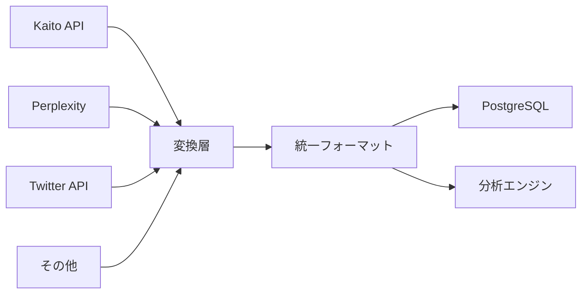

# BuzzFlow 統合データアーキテクチャ

## 🎯 課題
多様なデータソース（Twitter、RSSニュース、Perplexity等）をどう統合して分析するか

## 📋 現在のデータ構造

### 既存のテーブル
1. **BuzzPost** - Twitterバズ投稿
2. **NewsArticle** - RSSニュース記事
3. **ScheduledPost** - 予定投稿
4. **NewsThread** - AIニュースツリー

## 🏗️ 提案アーキテクチャ

### 1. 統一コンテンツモデル

```typescript
// すべてのコンテンツを統一的に扱うモデル
interface UnifiedContent {
  // 基本情報
  id: string
  source: 'twitter' | 'perplexity' | 'news' | 'reddit' | 'other'
  sourceId: string // 元のソースでのID
  url?: string
  
  // コンテンツ
  title?: string
  content: string
  summary?: string // AIで生成
  
  // メタデータ
  author?: {
    name: string
    id: string
    followers?: number
    verified?: boolean
  }
  
  // 時間情報
  publishedAt: Date
  collectedAt: Date
  updatedAt: Date
  
  // エンゲージメント（ソースによって異なる）
  metrics: {
    views?: number
    likes?: number
    shares?: number
    comments?: number
    score?: number // Reddit的なスコア
    relevance?: number // Perplexityの関連度
  }
  
  // 分析結果
  analysis?: {
    sentiment?: 'positive' | 'negative' | 'neutral'
    topics?: string[]
    entities?: string[] // 人名、企業名など
    buzzPotential?: number // 0-1
    relevanceToGoal?: number // あなたの目標との関連度
  }
  
  // リレーション
  relatedContents?: string[] // 関連コンテンツのID
  
  // 生データ（必要に応じて参照）
  rawData?: any
}
```

### 2. データ収集・変換フロー



### 3. 統合ビューアプローチ（既存DBを活用）

新しいテーブルを作る代わりに、既存のデータを統合的に扱うビューを作成：

```typescript
// app/lib/unified-view.ts
export async function getUnifiedContents(filters: {
  sources?: ('twitter' | 'news' | 'perplexity')[]
  dateRange?: { from: Date, to: Date }
  keywords?: string[]
}) {
  const results = []
  
  // Twitterデータ
  if (!filters.sources || filters.sources.includes('twitter')) {
    const tweets = await prisma.buzzPost.findMany({
      where: {
        postedAt: filters.dateRange ? {
          gte: filters.dateRange.from,
          lte: filters.dateRange.to
        } : undefined
      }
    })
    
    results.push(...tweets.map(tweet => ({
      id: `twitter_${tweet.id}`,
      source: 'twitter' as const,
      content: tweet.content,
      author: {
        name: tweet.authorUsername,
        followers: tweet.authorFollowers
      },
      publishedAt: tweet.postedAt,
      metrics: {
        likes: tweet.likesCount,
        retweets: tweet.retweetsCount,
        impressions: tweet.impressionsCount
      },
      url: tweet.url
    })))
  }
  
  // ニュースデータ
  if (!filters.sources || filters.sources.includes('news')) {
    const articles = await prisma.newsArticle.findMany({
      where: {
        publishedAt: filters.dateRange ? {
          gte: filters.dateRange.from,
          lte: filters.dateRange.to
        } : undefined
      }
    })
    
    results.push(...articles.map(article => ({
      id: `news_${article.id}`,
      source: 'news' as const,
      title: article.title,
      content: article.content,
      summary: article.summary,
      author: {
        name: article.source
      },
      publishedAt: article.publishedAt,
      metrics: {
        importance: article.importance
      },
      url: article.url
    })))
  }
  
  // ソートして返す
  return results.sort((a, b) => 
    b.publishedAt.getTime() - a.publishedAt.getTime()
  )
}
```

### 4. Perplexityデータの保存戦略

Perplexityのデータはリアルタイム性が重要なので、別アプローチを提案：

```prisma
// 軽量なPerplexity結果保存用
model PerplexityInsight {
  id          String   @id @default(uuid())
  query       String   // 検索クエリ
  answer      String   @db.Text // 回答
  sources     Json     // ソース情報
  topics      String[] // トピック
  confidence  Float    // 信頼度
  createdAt   DateTime @default(now())
  expiresAt   DateTime // 有効期限（24時間等）
  
  @@index([query])
  @@index([createdAt])
  @@map("perplexity_insights")
}
```

### 5. シンプルな統合分析の実装

```prisma
model UnifiedContent {
  id             String   @id @default(uuid())
  source         String   // twitter, perplexity, news, etc
  sourceId       String   // 元ソースでのID
  url            String?
  
  // コンテンツ
  title          String?
  content        String   @db.Text
  summary        String?  @db.Text
  
  // 著者情報（JSONで柔軟に）
  author         Json?
  
  // 時間
  publishedAt    DateTime
  collectedAt    DateTime @default(now())
  updatedAt      DateTime @updatedAt
  
  // メトリクス（JSONで柔軟に）
  metrics        Json     @default("{}")
  
  // 分析結果
  analysis       Json?    @default("{}")
  
  // タグ（多対多）
  tags           Tag[]    @relation("ContentTags")
  
  // インデックス
  @@index([source, publishedAt])
  @@index([collectedAt])
  @@map("unified_contents")
}

model Tag {
  id       String           @id @default(uuid())
  name     String           @unique
  contents UnifiedContent[] @relation("ContentTags")
  
  @@map("tags")
}
```

### 4. データ変換の実装例

```typescript
// app/lib/transformers/twitter-transformer.ts
export function transformTwitterData(tweet: KaitoTweet): UnifiedContent {
  return {
    id: generateId(),
    source: 'twitter',
    sourceId: tweet.id,
    url: tweet.url,
    content: tweet.fullText || tweet.text,
    author: {
      name: tweet.author.name,
      id: tweet.author.id,
      followers: tweet.author.followers,
      verified: tweet.author.isVerified
    },
    publishedAt: new Date(tweet.createdAt),
    collectedAt: new Date(),
    metrics: {
      views: tweet.viewCount,
      likes: tweet.likeCount,
      shares: tweet.retweetCount,
      comments: tweet.replyCount
    }
  }
}

// app/lib/transformers/perplexity-transformer.ts
export function transformPerplexityData(result: PerplexityResult): UnifiedContent {
  return {
    id: generateId(),
    source: 'perplexity',
    sourceId: result.id || generateHash(result.query),
    content: result.answer,
    summary: result.summary,
    author: {
      name: 'Perplexity AI',
      id: 'perplexity'
    },
    publishedAt: new Date(result.timestamp),
    collectedAt: new Date(),
    metrics: {
      relevance: result.confidence,
      score: result.sources.length // ソース数をスコアとして使用
    },
    analysis: {
      topics: result.topics,
      entities: result.entities
    }
  }
}
```

### 5. 統合分析システム

```typescript
// app/api/analysis/unified/route.ts
export async function analyzeUnifiedContent(filters: {
  sources?: string[]
  dateRange?: { from: Date, to: Date }
  topics?: string[]
}) {
  // 1. 統一フォーマットでデータ取得
  const contents = await prisma.unifiedContent.findMany({
    where: {
      source: filters.sources ? { in: filters.sources } : undefined,
      publishedAt: filters.dateRange ? {
        gte: filters.dateRange.from,
        lte: filters.dateRange.to
      } : undefined
    }
  })
  
  // 2. ソースを跨いだ分析
  const crossSourceAnalysis = {
    // トピックの勢い（全ソース横断）
    trendingTopics: analyzeTrendingTopics(contents),
    
    // ソース間の相関（Twitterで話題→ニュースになる等）
    sourceCorrelation: analyzeSourceCorrelation(contents),
    
    // 時系列での話題の流れ
    topicFlow: analyzeTopicFlow(contents),
    
    // バズ予測（複数ソースの情報を組み合わせ）
    buzzPrediction: predictBuzz(contents)
  }
  
  return crossSourceAnalysis
}
```

### 6. 実装の段階的アプローチ

#### Phase 1: 基本統合（1週間）
1. UnifiedContentモデルの実装
2. Twitter/Kaitoデータの変換
3. 基本的な統合ビュー

#### Phase 2: Perplexity統合（2週間目）
1. Perplexityデータの変換ロジック
2. リアルタイム更新の仕組み
3. クロスソース分析の基本版

#### Phase 3: 高度な分析（3週間目以降）
1. AI駆動の関連性分析
2. 予測モデルの構築
3. 自動タグ付け・分類

### 7. 実用的な活用例

```typescript
// 毎朝のAI秘書で使用
async function morningBriefing() {
  // 1. 過去24時間の全ソースデータを統合取得
  const contents = await getUnifiedContents({
    sources: ['twitter', 'perplexity', 'news'],
    dateRange: { from: yesterday, to: now }
  })
  
  // 2. あなたの目標に関連する内容を抽出
  const relevant = contents.filter(c => 
    c.analysis?.relevanceToGoal > 0.7
  )
  
  // 3. 投稿案を生成
  const suggestions = await generatePostIdeas({
    trendingTopics: extractTrendingTopics(relevant),
    yourExpertise: ['ホワイトカラー代替', '50代', 'クリエイティブ'],
    targetAudience: 'AI不安層'
  })
  
  return {
    summary: '今日の注目トピック',
    contents: relevant.slice(0, 5),
    suggestions: suggestions
  }
}
```

### 8. メリット

1. **拡張性**: 新しいデータソースも同じ形式に変換するだけ
2. **分析の一貫性**: すべてのデータを同じ方法で分析可能
3. **クロスソース洞察**: Twitter×ニュース×Perplexityの相関が見える
4. **保守性**: データモデルが統一されているので管理しやすい

### 9. 注意点

1. **変換の品質**: 各ソースの特性を失わないように注意
2. **更新頻度**: リアルタイムデータの扱い方を検討
3. **ストレージ**: データ量が増えた時の対策

## 🎯 次のステップ

1. **UnifiedContentモデルの実装**（2時間）
2. **既存データの移行スクリプト**（1時間）
3. **Perplexity変換器の実装**（2時間）
4. **統合ダッシュボードの作成**（4時間）

これにより、どんなデータソースが増えても柔軟に対応できる基盤ができます。