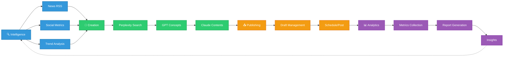

# X_BUZZ_FLOW システムアーキテクチャ図

## 全体フロー



## データフロー詳細

```mermaid
sequenceDiagram
    participant User
    participant Intel as Intelligence
    participant Create as Creation
    participant Pub as Publishing
    participant Analyze as Analytics
    
    User->>Intel: ニュース収集開始
    Intel->>Intel: RSS収集・分析
    Intel->>Create: 分析済みデータ
    Create->>Create: Perplexity検索
    Create->>Create: GPTコンセプト生成
    Create->>Create: Claude投稿生成
    Create->>Pub: 下書き作成
    Pub->>Pub: スケジューリング
    Pub->>Analyze: 投稿実行
    Analyze->>Analyze: メトリクス収集
    Analyze-->>Intel: インサイト
```

## 使い方

1. **GitHub**: このファイルをGitHubで開くと自動的に図が表示されます
2. **VS Code**: Mermaid拡張機能をインストールしてプレビュー表示
3. **ブラウザ**: flow-diagram.htmlをブラウザで開く
4. **オンライン**: https://mermaid.live/ にコードをコピー＆ペースト