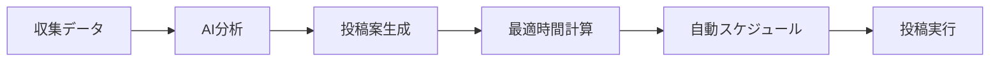

# BuzzFlowワークフロー自動化計画

## 🔥 現状の課題
現在のワークフローは手動操作が多すぎる：
1. クエリごとに収集ボタンをクリック
2. 収集結果を一つずつチェック
3. ニュースも別途チェック
4. 投稿文案を手動作成
5. スケジュール設定も手動

## 🚀 自動化ソリューション

### 1. 一括自動収集システム

#### バッチ収集エンドポイント
```typescript
// /api/batch-collect/route.ts
export async function POST(request: Request) {
  // 全プリセットを並列実行
  const results = await Promise.all(
    presets.map(preset => collectWithPreset(preset))
  )
  
  // 重複を除去して保存
  const uniquePosts = removeDuplicates(results.flat())
  
  // 自動分析も実行
  const analyzed = await analyzeAll(uniquePosts)
  
  return { collected: uniquePosts.length, analyzed: analyzed.length }
}
```

#### 定期実行スケジューラー
```typescript
// 3時間ごとに自動収集
// 朝6時、9時、12時、15時、18時、21時
const COLLECTION_SCHEDULE = '0 6,9,12,15,18,21 * * *'
```

### 2. AIキュレーション＆RP候補自動抽出

#### 自動スコアリング
```typescript
interface AutoScoring {
  relevanceScore: number      // テーマ関連度
  buzzPotential: number      // バズ可能性
  rpValue: number            // RP価値
  authorInfluence: number    // 著者影響力
  totalScore: number         // 総合スコア
}
```

#### RP候補の自動抽出条件
- フォロワー10万人以上の大物
- エンゲージメント率5%以上
- 過去6時間以内の投稿
- AI/テクノロジー/働き方関連

### 3. 統合レビューダッシュボード

#### 朝のAI秘書ダッシュボード
```
📊 今日のハイライト（自動生成）
├── 🔥 トレンド: Perplexityから最新動向
├── 💎 RP必須案件: TOP 5件（自動抽出）
├── 📰 重要ニュース: スコア0.8以上
└── 💡 投稿提案: 3パターン自動生成済み
```

#### ワンクリックアクション
- ✅ RP投稿（文案自動生成済み）
- ✅ ニューススレッド投稿
- ✅ オリジナル投稿（3案から選択）
- ✅ 全てスケジュール予約

### 4. スマート投稿パイプライン

#### 自動生成フロー


#### 投稿タイミング最適化
- 通勤時間帯: 7-9時（中優先度）
- ランチタイム: 12-13時（低優先度）
- ゴールデンタイム: 21-23時（最優先）
- フォロワーアクティブ時間を学習

### 5. 実装優先順位

#### 🔥 今すぐ実装（1-2日）
1. **バッチ収集API**
   - 全プリセット一括実行
   - 重複除去機能
   - 実行時間: 3時間

2. **RP候補自動抽出**
   - スコアリングロジック
   - TOP5自動選出
   - 実行時間: 2時間

#### 📈 次に実装（3-5日）
3. **統合ダッシュボード**
   - 朝のブリーフィング画面
   - ワンクリックアクション
   - 実行時間: 1日

4. **自動スケジューラー**
   - Vercel Cronジョブ設定
   - 最適時間自動計算
   - 実行時間: 4時間

### 6. 期待される効果

#### Before（現状）
- 手動収集: 30分/日
- チェック作業: 45分/日
- 投稿作成: 30分/日
- **合計: 1時間45分/日**

#### After（自動化後）
- 朝のレビュー: 5分
- 投稿選択: 5分
- 微調整: 5分
- **合計: 15分/日**

**⏰ 時間削減: 1時間30分/日 = 月45時間の削減**

### 7. 2025年に狙うべきRP対象

#### AI×ビジネス系
- @chiasenhac（深津貴之）- note戦略の第一人者
- @daiyamond（ダイヤモンドオンライン）- ビジネス系メディア
- @nikkei（日経新聞）- 経済ニュース
- @toyokeizai（東洋経済）- ビジネストレンド

#### テクノロジー×働き方
- @hal_sk（平野晴樹）- DX推進
- @kazuho（Kazuho Okui）- エンジニアリング
- @maskin（増田真樹）- テックジャーナリスト

#### AI特化
- @hillbig（岡野原大輔）- PFN副社長
- @ochyai（落合陽一）- メディアアーティスト
- @shi3z（清水亮）- AI起業家

#### 新興インフルエンサー
- AI関連の新しいアカウント（フォロワー1-5万）
- 技術系YouTuberのTwitterアカウント
- 海外AI情報を日本語化している人

### 8. 次のアクション

```bash
# 1. バッチ収集APIの実装
touch app/api/batch-collect/route.ts
touch app/lib/auto-scoring.ts

# 2. 統合ダッシュボードの作成
touch app/dashboard-v2/page.tsx
touch app/components/ai-briefing.tsx

# 3. Cronジョブの設定
touch app/api/cron/auto-collect/route.ts
```

## 🎯 まとめ

自動化により：
1. **時間削減**: 1日1時間30分の削減
2. **品質向上**: AI分析による最適化
3. **機会損失防止**: 24時間監視でトレンドを逃さない
4. **スケーラビリティ**: データ量が増えても対応可能

これにより、戦略立案とコンテンツの質向上に集中できます。