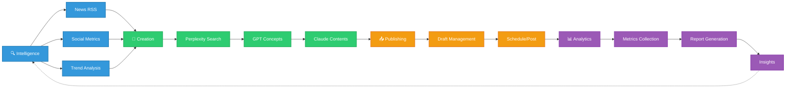
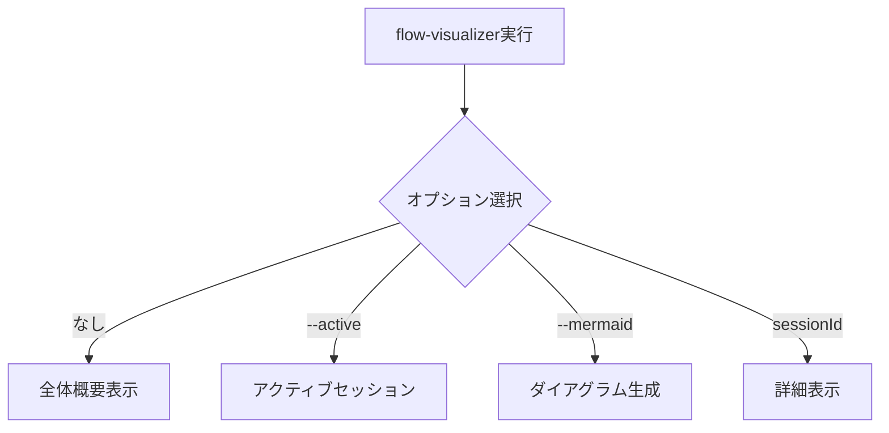

# Mermaidテスト

## flow-visualizerの出力を確認

```mermaid
graph LR
    %% Intelligence Layer
    A[🔍 Intelligence] --> A1[News RSS]
    A --> A2[Social Metrics]
    A --> A3[Trend Analysis]
    
    %% Creation Layer
    A1 --> B[🎨 Creation]
    A2 --> B
    A3 --> B
    B --> B1[Perplexity Search]
    B1 --> B2[GPT Concepts]
    B2 --> B3[Claude Contents]
    
    %% Publishing Layer
    B3 --> C[📤 Publishing]
    C --> C1[Draft Management]
    C1 --> C2[Schedule/Post]
    
    %% Analytics Layer
    C2 --> D[📊 Analytics]
    D --> D1[Metrics Collection]
    D1 --> D2[Report Generation]
    D2 --> D3[Insights]
    D3 -.-> A
    
    %% Styling
    classDef intel fill:#3498db,stroke:#2980b9,stroke-width:2px,color:#fff
    classDef create fill:#2ecc71,stroke:#27ae60,stroke-width:2px,color:#fff
    classDef publish fill:#f39c12,stroke:#e67e22,stroke-width:2px,color:#fff
    classDef analyze fill:#9b59b6,stroke:#8e44ad,stroke-width:2px,color:#fff
    
    class A,A1,A2,A3 intel
    class B,B1,B2,B3 create
    class C,C1,C2 publish
    class D,D1,D2,D3 analyze
```

## シンプルな例

```mermaid
graph TD
    A[flow-visualizer実行] --> B{オプション選択}
    B -->|なし| C[全体概要表示]
    B -->|--active| D[アクティブセッション]
    B -->|--mermaid| E[ダイアグラム生成]
    B -->|sessionId| F[詳細表示]
```